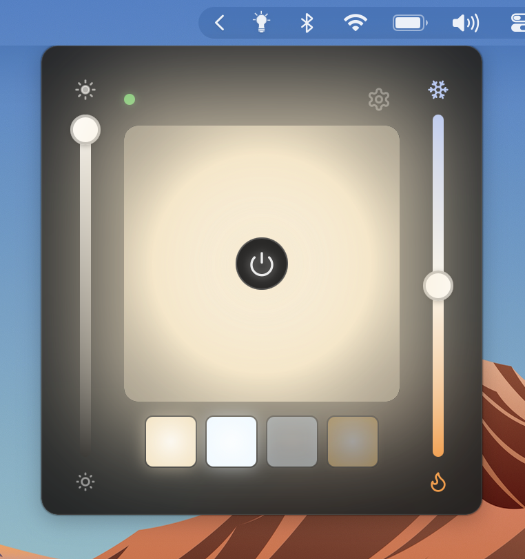
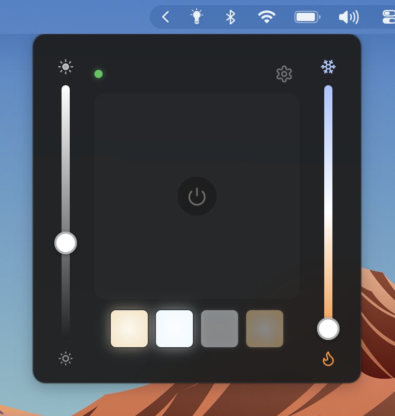
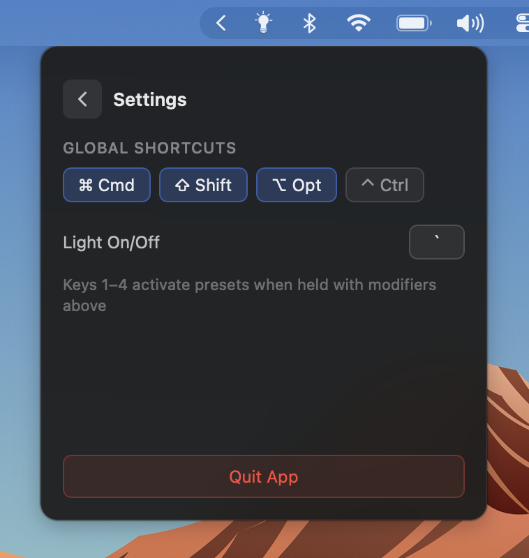

# Neewer USB Control

USB control for Neewer LED panel lights on macOS. Includes a menubar GUI app and a Python CLI.

The USB serial protocol was reverse-engineered from the proprietary NEEWER Control Center app binary — this is the first public USB control implementation for any Neewer light. All existing projects use Bluetooth only. See [RESEARCH.md](RESEARCH.md) for the full protocol documentation.

> **Tested on:** Neewer PL81-Pro (model PL81-Pro-1260740) on macOS Sequoia. Other Neewer USB lights likely use the same protocol, but your mileage may vary. Contributions and test reports for other models are welcome.


<p align="center">
  
  
  
</p>

## Features

- **Menubar app** — lives in the macOS menu bar, click to open a dropdown panel
- **Live preview** — shows the light's color and brightness in real time
- **Brightness control** — vertical slider with gamma correction for perceptual linearity
- **Color temperature** — 2900K (warm) to 7000K (cool) vertical slider
- **Power button** — on/off with connection status indicator (glows when on, red when disconnected)
- **Presets** — save up to 4 presets as color swatches, click to apply
- **Live feedback** — UI updates when you turn the physical knob on the light
- **Auto-connect** — detects the light on USB plug/unplug
- **Remembers state** — persists brightness, temperature, and presets across restarts
- **Python CLI** — lightweight alternative for scripting and automation

## Requirements

- macOS (tested on Sequoia / macOS 15+)
- Neewer LED panel with USB-C connection (tested: PL81-Pro)
- CH340 USB serial driver (included in macOS by default since Ventura)

## Quick Start — GUI App

### Install from source

You'll need [Rust](https://rustup.rs/), [Node.js](https://nodejs.org/), and [pnpm](https://pnpm.io/):

```bash
git clone https://github.com/m-rk/neewer-usb-control.git
cd neewer-usb-control/app
pnpm install
pnpm tauri build
```

The built app is at `app/src-tauri/target/release/bundle/macos/Neewer USB Control.app`. Drag it to your Applications folder.

> **First launch:** macOS will block the app since it's ad-hoc signed. Go to System Settings → Privacy & Security and click "Open Anyway". This only happens once.

### Development

```bash
cd app
pnpm tauri dev
```

This starts the app with hot-reload for the frontend.

## Quick Start — Python CLI

Requires Python 3 and [pyserial](https://pypi.org/project/pyserial/):

```bash
pip install pyserial
```

### Usage

```bash
# Set brightness and color temperature
python3 neewer_usb_control.py 100           # 100% brightness, default 4950K
python3 neewer_usb_control.py 100 2900      # 100% brightness, warmest
python3 neewer_usb_control.py 100 7000      # 100% brightness, coolest
python3 neewer_usb_control.py 50 4000       # 50% brightness, warm white

# Power shortcuts
python3 neewer_usb_control.py on            # 100% at default temp
python3 neewer_usb_control.py off           # brightness 0

# Read status (turn the physical knob to see updates)
python3 neewer_usb_control.py status
```

Temperature range is 2900K–7000K in 19 discrete steps (~228K each).

## Protocol Overview

The light communicates over USB serial (CH340 chip, 115200 baud, 8N1). Commands and status packets share the same format:

```
[0x3A] [tag] [payload_len] [payload...] [checksum_hi] [checksum_lo]
```

- **Prefix:** `0x3A` (ASCII `:`)
- **Checksum:** 16-bit big-endian sum of all preceding bytes
- **CCT command (tag 0x02):** `3A 02 03 01 [brightness] [temp_byte] [cs_hi] [cs_lo]`
- **Status:** light echoes commands back and sends unprompted packets on knob turns

The key discovery was the **16-bit big-endian checksum** — over 100 serial probe attempts failed with 1-byte checksums before disassembling the Neewer app binary revealed the correct algorithm.

For the full reverse-engineering journey, protocol details, BLE protocol comparison, and HID investigation, see [RESEARCH.md](RESEARCH.md).

## Project Structure

```
neewer-usb-control/
├── app/                        # Tauri menubar app (Svelte + Rust)
│   ├── src/                    # Frontend (Svelte + TypeScript)
│   └── src-tauri/src/          # Backend (Rust)
│       ├── protocol.rs         # Packet encoding/decoding/checksum
│       ├── serial.rs           # Serial port management + read loop
│       ├── commands.rs         # Tauri commands exposed to frontend
│       └── lib.rs              # App setup, tray icon, auto-connect
├── neewer_usb_control.py       # Python CLI
├── temp_calibrate.py           # Interactive temperature calibration tool
├── temp_calibration.json       # Calibration results (19 steps mapped)
└── RESEARCH.md                 # Full protocol documentation
```

## Compatibility

| What | Status |
|------|--------|
| **Neewer PL81-Pro** | Confirmed working |
| **Other Neewer USB lights** | Likely compatible — same protocol family, untested |
| **macOS** | Tested on Sequoia (15+) |
| **Linux** | Should work (CH340 driver is built-in), untested |
| **Windows** | Should work (needs CH340 driver installed), untested |

If you test on a different model or platform, please open an issue with your results.

## Contributing

Contributions are welcome — especially:

- **Test reports** for other Neewer light models (does the protocol work? what's different?)
- **Temperature mapping** for models with different CCT ranges
- **Linux/Windows testing**
- **UI improvements** to the menubar app
- **Global keyboard shortcuts** improvements

### Development setup

```bash
# Clone
git clone https://github.com/m-rk/neewer-usb-control.git
cd neewer-usb-control

# GUI app
cd app
pnpm install
pnpm tauri dev

# Rust tests
cd app/src-tauri
cargo test
```

## Known Limitations

- Power on/off command (tag `0x06`) is decoded from the app binary but doesn't produce a response on the PL81-Pro. On/off is implemented as brightness 0/100 instead.
- HSI (RGB) mode exists in the protocol but the PL81-Pro is bi-color only — no RGB LEDs.
- The temperature slider has 19 discrete steps, matching the hardware. You can't set arbitrary Kelvin values between steps.


## License

MIT

## Acknowledgments

- Protocol decoded by disassembling the NEEWER Control Center app binary using `otool`
- BLE protocol research by the [NeewerLite](https://github.com/keefo/NeewerLite) and [NeewerLite-Python](https://github.com/taburineagle/NeewerLite-Python) communities
- In-app glyphs from [Lucide](https://lucide.dev/) (ISC license)
- Built with [Tauri](https://tauri.app/), [Svelte](https://svelte.dev/), and [serialport-rs](https://github.com/serialport/serialport-rs)
